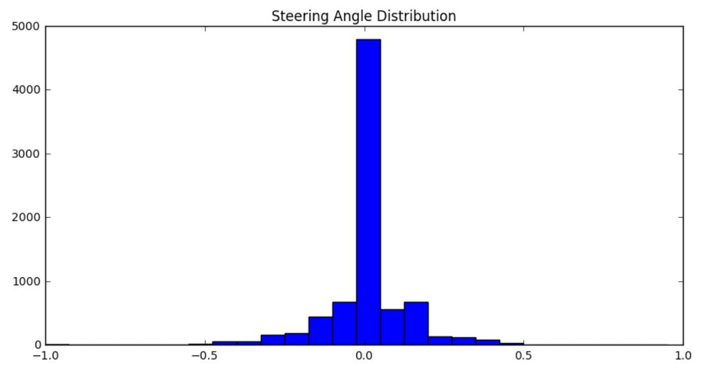
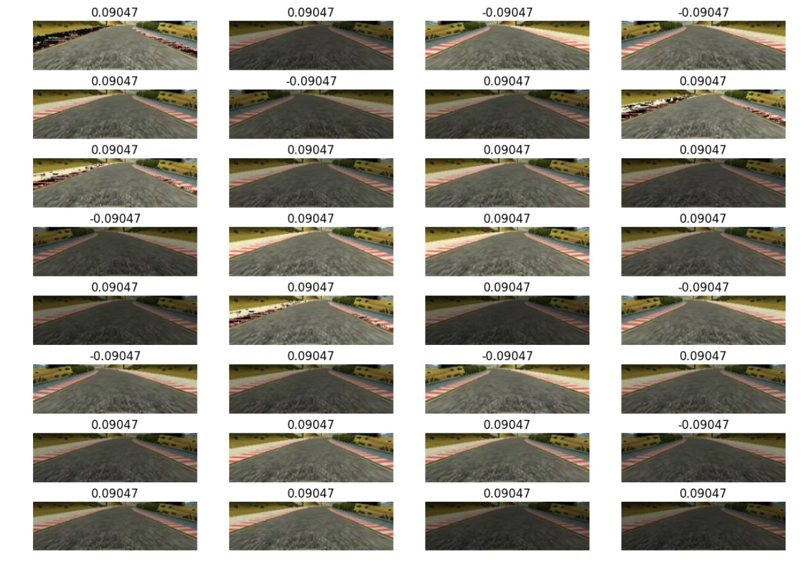
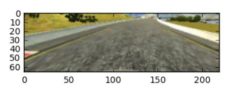

# Behavioral-Cloning

This repo contains code for a project I did as a part of [Udacity's Self Driving Car Nano Degree Program](https://www.udacity.com/drive). We had to train a car to drive itself in a simulator. The car was trained to drive itself using a deep neural network.

# Datset

I used the dataset provided by Udacity which are about 8000 images. More images can be generated using Udacity's simulator.

The dataset contains JPG images of dimensions 160x320x3. Here are some sample images from the dataset.

<<<<<<< HEAD

# Steering Angle Histogram

By observing this histogram we can say that much of the dataset has 0 steering angle and due to this model may be biased towards it.

# Augmentation Techniques Used and Architecture

I have to thank this [NVIDIA paper](http://images.nvidia.com/content/tegra/automotive/images/2016/solutions/pdf/end-to-end-dl-using-px.pdf) and [this blog post](https://chatbotslife.com/using-augmentation-to-mimic-human-driving-496b569760a9#.d779iwp28) for suggesting these techniques.

1.Flip the images horizontally.
2.Brightness Adjustment.
3.Adding random shadows.

Below is an example of generated data from the image source.

# Preproceesing Images
1. I noticed that the bonet of the car is visible in the lower portion of the image.
2. And also the portion above the horizon can also be ignored.
We can crop the image and remove this.

# Simulation on the Test Track

Here is the [Driving Simulation on the Test Track](https://youtu.be/ZrM7kzP8yzM).
