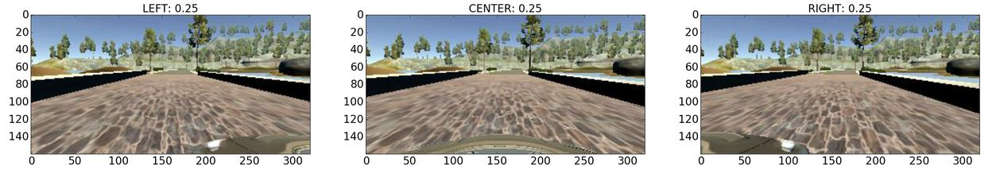

# Behavioral-Cloning

This repo contains code for a project I did as a part of [Udacity's Self Driving Car Nano Degree Program](https://www.udacity.com/drive). We had to train a car to drive itself in a simulator. The car was trained to drive itself using a deep neural network.

# Datset

I used the dataset provided by Udacity which are about 8000 images. More images can be generated using Udacity's simulator.

The dataset contains JPG images of dimensions 160x320x3. Here are some sample images from the dataset.

